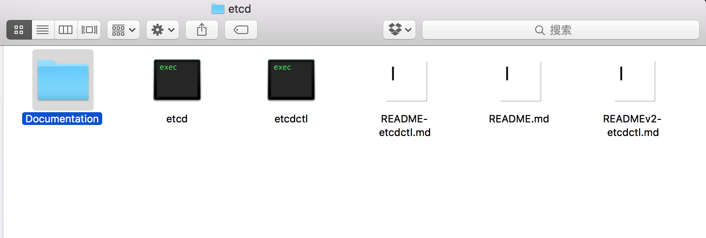
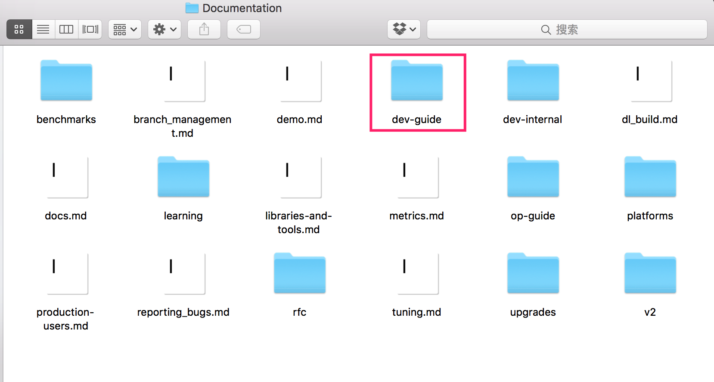

# 使用etcd开发

## 内容

内容列表如下：

- [搭建本地集群](local_cluster.md)
- [和etcd交互](interacting_v3.md)
- [API 参考文档](api_reference_v3.md)
- [gRPC 网关](api_grpc_gateway.md)
- [内嵌的etcd](embed_etcd.md)
- [试验性的API和特性](experimental_apis.md)

## 额外说明

1. 这些内容相当于是 etcd3 的开发手册，针对的是 etcd3 的使用者，如果只是 "用" etcd，需要重点阅读这些内容。

2. 内容来自 github 官网，地址： https://github.com/coreos/etcd/tree/master/Documentation/dev-guide

3. 这些文档打包在 etcd3 的发行包中，平时使用时可以随时阅读。

	etcd3解压后，有一个 Documentent 目录：

    

	Documentent 目录 下的 dev-guide 目录就是上述内容，op-guide 和 leaning 目录下是后面要介绍的内容：

    