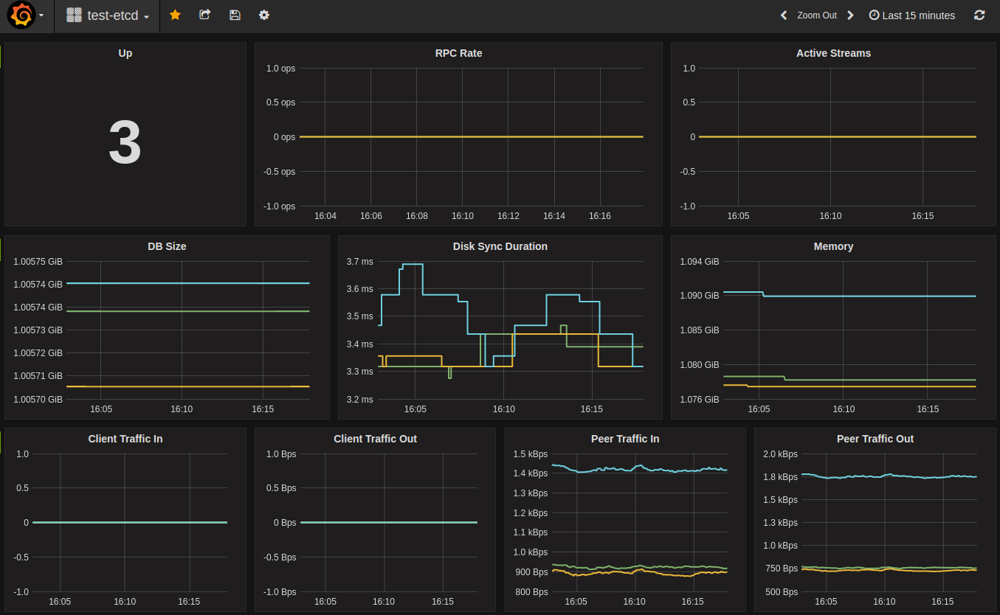

# 监控 etcd

etcd 在客户端监听端口的路径 `/metrics` 下获取指标数据。

可通过 `curl` 获取指标数据：

```bash
$ curl -L http://localhost:2379/metrics

# HELP etcd_debugging_mvcc_keys_total Total number of keys.
# TYPE etcd_debugging_mvcc_keys_total gauge
etcd_debugging_mvcc_keys_total 0
# HELP etcd_debugging_mvcc_pending_events_total Total number of pending events to be sent.
# TYPE etcd_debugging_mvcc_pending_events_total gauge
etcd_debugging_mvcc_pending_events_total 0
...
```

## Prometheus

启动 [Prometheus](https://prometheus.io/) 监控服务获取和记录指标数据。

首先，安装 Prometheus：

```bash
PROMETHEUS_VERSION="1.3.1"
wget https://github.com/prometheus/prometheus/releases/download/v$PROMETHEUS_VERSION/prometheus-$PROMETHEUS_VERSION.linux-amd64.tar.gz -O /tmp/prometheus-$PROMETHEUS_VERSION.linux-amd64.tar.gz
tar -xvzf /tmp/prometheus-$PROMETHEUS_VERSION.linux-amd64.tar.gz --directory /tmp/ --strip-components=1
/tmp/prometheus -version
```

将 Prometheus scraper 的目标设置为 etcd 集群：

```bash
cat > /tmp/test-etcd.yaml <<EOF
global:
  scrape_interval: 10s
scrape_configs:
  - job_name: test-etcd
    static_configs:
    # metrics_path defaults to '/metrics'
    - targets: ['10.240.0.32:2379','10.240.0.33:2379','10.240.0.34:2379']
EOF
cat /tmp/test-etcd.yaml
```

启动 Prometheus：

```bash
nohup /tmp/prometheus \
    -config.file /tmp/test-etcd.yaml \
    -web.listen-address ":9090" \
    -storage.local.path "test-etcd.data" >> /tmp/test-etcd.log  2>&1 &
```

现在 Prometheus 将会以 10s 的频率收集指标数据。

## Grafana

[Grafana](http://grafana.org/) 内置对 Prometheus 的支持，仅仅需要增加 Prometheus 数据源：

```
Name:   test-etcd
Type:   Prometheus
Url:    http://localhost:9090
Access: proxy
```

然后引入 [etcd 仪表盘模板][./grafana.json] 并修改；参考 [例子](http://dash.etcd.io/dashboard/db/test-etcd)。

仪表试图如下：




